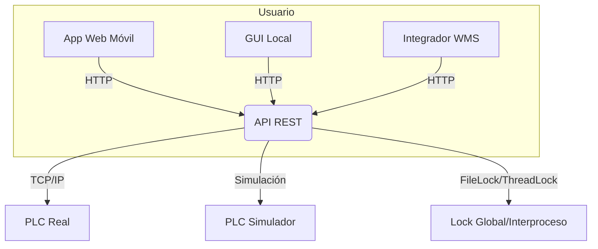

# carousel_api

[](https://www.python.org/)
[](https://flask.palletsprojects.com/)
[](https://socket.io/)
[]()
[]()
[]()
[](https://github.com/PyCQA/bandit)
[](LICENSE)
[](https://github.com/iapunto/carousel_api/commits/main)

---

## Descripción general

**carousel_api** es un sistema robusto para el control de un carrusel industrial mediante PLC Delta AS Series, con:

- **API RESTful** en Python (Flask)
- **GUI local** (Python + customtkinter)
- **App web móvil** para control remoto en red local
- **Simulador de PLC** para pruebas sin hardware
- **Mecanismos de bloqueo global e interproceso** para máxima seguridad y concurrencia
- **Pruebas unitarias, integración y concurrencia**
- **Auditoría de dependencias y seguridad automatizada**

---

## Arquitectura



- **API REST**: expone endpoints para estado y control del carrusel.
- **GUI**: interfaz local para operación y monitoreo.
- **App web**: control desde cualquier dispositivo en la red local.
- **Locks**: aseguran acceso exclusivo al PLC, incluso entre procesos distintos.
- **Simulador**: permite desarrollo y pruebas sin hardware real.

---

## Ejemplo de uso de la API

### Consultar estado

```bash
curl -X GET http://localhost:5001/v1/status
```

Respuesta:

```json
{
  "success": true,
  "data": {
    "status": { ... },
    "position": 2,
    "raw_status": 218
  },
  "error": null,
  "code": null
}
```

### Enviar comando de movimiento

```bash
curl -X POST http://localhost:5001/v1/command -H "Content-Type: application/json" -d '{"command": 1, "argument": 3}'
```

Respuesta:

```json
{
  "success": true,
  "data": { ... },
  "error": null,
  "code": null
}
```

---

## App web móvil

- Accesible desde cualquier dispositivo en la red local: `http://<IP_SERVIDOR>:8181`
- Permite seleccionar cangilón (1-6), mover y ver feedback inmediato.
- Preparada para exponer con ngrok/túneles para pruebas remotas.

---

## Mecanismo de locks y concurrencia

- **Lock global (threading.Lock):** evita acceso simultáneo dentro del mismo proceso.
- **Lock interproceso (FileLock):** evita acceso simultáneo entre procesos distintos (API, GUI, app web, etc.).
- Si el PLC está ocupado, la API responde con error 409 y mensaje claro.
- Los locks se gestionan de forma robusta y segura, evitando deadlocks y fugas.

---

## Flujo de despliegue y pruebas

1. Instalar dependencias:

   ```bash
   pip install -r requirements.txt
   ```

2. Ejecutar pruebas y auditoría:

   ```bash
   pytest tests/
   pip-audit
   bandit -r .
   ```

3. Lanzar la API:

   ```bash
   python main.py
   ```

4. Lanzar la app web (opcional):

   ```bash
   python web_remote_control.py
   ```

5. Acceder desde GUI, app web o integrador externo.

---

## Troubleshooting y FAQs

- **Error: PLC ocupado por otro proceso**
  - Otro proceso está usando el PLC. Espera unos segundos e intenta de nuevo.
- **No se puede conectar al PLC**
  - Verifica IP, puerto y cableado. Revisa logs para detalles.
- **La posición no se actualiza**
  - Asegúrate de que el PLC esté enviando el dato correcto. Usa los logs de depuración.
- **¿Cómo simulo el PLC?**
  - Ejecuta la API con el simulador activado en la configuración.
- **¿Cómo expongo la app web fuera de la red local?**
  - Usa ngrok o similar y apunta la app web a la URL pública.
- **¿Cómo ejecuto las pruebas de concurrencia?**
  - Simplemente ejecuta `pytest tests/` y revisa que todos los tests pasen.

---

## Notas y recomendaciones

- Mantén las dependencias actualizadas y ejecuta auditorías periódicas.
- Documenta cada cambio relevante en el `CHANGELOG.md`.
- Consulta el `PLAN_ACCION.md` para seguimiento detallado del proyecto.
- Para integración avanzada (WMS), consulta la guía específica en `/docs/` (si existe).

---

¿Dudas o sugerencias? ¡Abre un issue o contacta al equipo de desarrollo!

---

## 🛠️ Tecnologías principales

- **Python 3.12+**
- **Flask** (API REST)
- **Flask-SocketIO** y **python-socketio** (comunicación en tiempo real)
- **Eventlet** (servidor asíncrono)
- **CustomTkinter** (GUI)
- **Bandit, pip-audit** (seguridad)
- **Pytest** (tests y cobertura)

---

## 📦 Arquitectura

```
[GUI] <---Socket.IO---> [API Flask] <---TCP/IP---> [PLC Delta / Simulador]
```

- `api.py`: API principal y servidor de eventos.
- `models/plc.py`: Comunicación con PLC real.
- `models/plc_simulator.py`: Simulador de PLC.
- `controllers/carousel_controller.py`: Lógica de negocio y validaciones.
- `commons/utils.py`: Utilidades y validaciones centralizadas.
- `main.py`: Lanzador de la aplicación (API + GUI).

---

## 🔗 Endpoints principales

| Método | Ruta           | Descripción                        | Parámetros         |
|--------|----------------|------------------------------------|--------------------|
| GET    | /v1/status     | Consulta el estado actual del PLC  | -                  |
| POST   | /v1/command    | Envía un comando al PLC/simulador  | `command`, `argument` |

**Ejemplo de uso:**

```bash
curl -X GET http://localhost:5000/v1/status
curl -X POST http://localhost:5000/v1/command -H "Content-Type: application/json" -d '{"command":1,"argument":3}'
```

---

## ⚡ Comunicación en tiempo real

- La GUI y cualquier cliente pueden suscribirse a eventos `plc_status` vía Socket.IO.
- Actualizaciones instantáneas ante cualquier cambio de estado, sin necesidad de polling.

---

## 🧑‍💻 Instalación rápida

   ```bash
git clone https://github.com/iapunto/carousel_api.git
cd carousel_api
   python -m venv venv
source venv/bin/activate  # o venv\Scripts\activate en Windows
   pip install -r requirements.txt
python main.py
```

Configura `config.json` según tu entorno (ver ejemplo en el archivo).

---

## 🧪 Pruebas y calidad

- Ejecuta todos los tests:

  ```bash
  python -m unittest discover -s tests
  ```

- Cobertura y seguridad se validan automáticamente en CI/CD (GitHub Actions).

---

## 🔒 Seguridad y buenas prácticas

- **Análisis estático** con Bandit y pip-audit en cada commit/push.
- **CORS restringido** y validaciones estrictas de entrada.
- **No se almacenan credenciales sensibles** en texto plano.
- **Manejo global de errores** y límites de payload.
- **Documentación y código limpio** siguiendo PEP8 y buenas prácticas.

---

## 👨‍🏭 Créditos y soporte

- Desarrollado por **IA Punto Soluciones Tecnológicas** para **Industrias Pico S A S**.
- Para soporte, sugerencias o incidencias, abre un issue o contacta a los responsables del proyecto.

---
