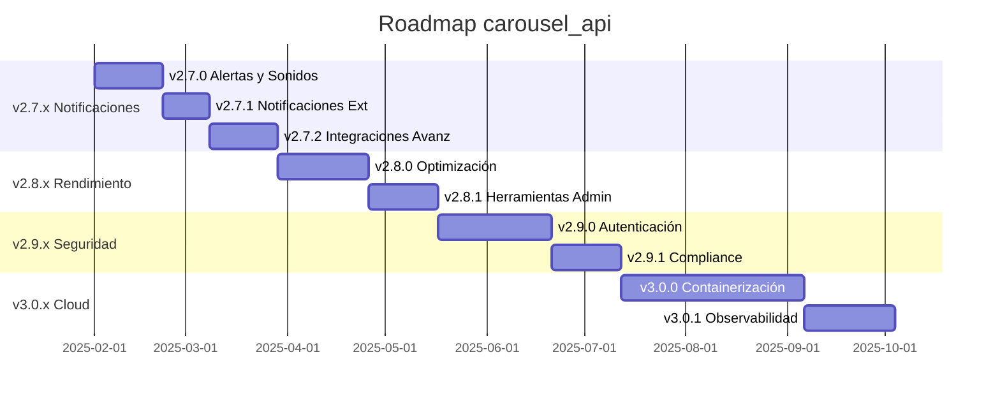

# 🗺️ Roadmap - Futuras Funcionalidades

Planificación de futuras versiones y mejoras para carousel_api.

---

## 🎯 Versión Actual: v2.6.0

### ✅ Características Implementadas

- **Sistema Multi-PLC**: Gestión de múltiples carruseles
- **Aplicación Web Moderna**: Diseño responsive con glassmorphism
- **API REST Completa**: Endpoints para Single-PLC y Multi-PLC
- **WebSocket en Tiempo Real**: Comunicación asíncrona
- **GUI de Escritorio**: Interfaz con CustomTkinter
- **Simulador Integrado**: Testing sin hardware
- **Documentación Completa**: Wiki y guías de integración

---

## 🚀 v2.7.x - Sistema de Notificaciones y Alertas

### 🔔 v2.7.0 - Notificaciones Tempranas

**Objetivo:** Implementar un sistema de notificaciones proactivas y alertas audibles para mejorar la experiencia del operador.

#### Características Principales

**Sistema de Alertas Proactivas**

- Detección de patrones anómalos en estados de máquinas
- Predicción de fallos basada en histórico de estados
- Alertas de mantenimiento preventivo
- Notificaciones de rendimiento degradado

**Dashboard de Alertas**

- Panel dedicado para alertas activas
- Clasificación por criticidad (Info, Warning, Critical)
- Timeline de eventos y alertas
- Filtros por máquina y tipo de alerta

**Configuración de Umbrales**

- Configuración personalizable por máquina
- Umbrales de tiempo de respuesta
- Límites de operaciones por hora
- Configuración de intervalos de mantenimiento

**Sistema de Sonidos y Alertas Audibles**

- Biblioteca de sonidos diferenciados:
  - ✅ Operación exitosa (beep corto)
  - ⚠️ Advertencia (doble beep)
  - ❌ Error/Alarma (beep largo + repetición)
  - 🔧 Mantenimiento requerido (secuencia especial)
- Motor de audio con `pygame` o `playsound`
- Control de volumen configurable
- Modo silencioso/audible por turno
- Colas de sonidos para evitar solapamiento

#### Estructura de Archivos

```
carousel_api/
├── notifications/
│   ├── __init__.py
│   ├── alert_engine.py          # Motor de alertas principales
│   ├── sound_manager.py         # Gestión de sonidos
│   ├── notification_config.py   # Configuración de notificaciones
│   └── external_notifiers.py    # Email, webhooks, etc.
├── assets/
│   └── sounds/
│       ├── success.wav
│       ├── warning.wav
│       ├── error.wav
│       └── maintenance.wav
└── config/
    └── notifications_config.json # Configuración de alertas
```

#### Configuración de Ejemplo

```json
{
  "notifications": {
    "audio_enabled": true,
    "volume": 0.7,
    "quiet_hours": {
      "enabled": true,
      "start": "22:00",
      "end": "06:00"
    },
    "alerts": {
      "connection_timeout": {
        "enabled": true,
        "threshold_seconds": 30,
        "sound": "warning.wav",
        "repeat_interval": 60
      },
      "operation_success": {
        "enabled": true,
        "sound": "success.wav"
      },
      "critical_alarm": {
        "enabled": true,
        "sound": "error.wav",
        "repeat_count": 3,
        "email_notification": true
      }
    }
  }
}
```

**Tiempo Estimado:** 2-3 semanas  
**Prioridad:** Alta

### 📧 v2.7.1 - Notificaciones Externas

**Notificaciones Email/SMS**

- Integración con SMTP para emails
- Webhooks para sistemas externos
- Notificaciones push (futuro)

**Analytics de Alertas**

- Dashboard de métricas de alertas
- Frecuencia de alertas por máquina
- Tiempo de resolución promedio
- Tendencias de fallos
- Reportes de disponibilidad

**Tiempo Estimado:** 1-2 semanas  
**Prioridad:** Media

### 🔗 v2.7.2 - Integraciones Avanzadas

**Notificaciones Bidireccionales WMS**

- Alertas desde WMS hacia operadores
- Estado de alertas hacia sistemas externos
- Sincronización de eventos críticos

**Interfaz Móvil (Futuro)**

- App móvil de alertas
- Notificaciones push en tiempo real
- Dashboard móvil simplificado
- Control remoto básico

**Tiempo Estimado:** 2-3 semanas  
**Prioridad:** Baja

---

## 🌟 v2.8.x - Mejoras de Rendimiento y Escalabilidad

### ⚡ v2.8.0 - Optimización de Rendimiento

**Base de Datos Mejorada**

- Migración de JSON a SQLite/PostgreSQL
- Índices optimizados para consultas
- Histórico de estados y comandos
- Backup automático de datos

**Cache Inteligente**

- Redis para cache de estados
- Cache distribuido para múltiples instancias
- Invalidación automática de cache
- Métricas de hit ratio

**API Optimizada**

- Paginación en endpoints de listado
- Compresión gzip automática
- Rate limiting avanzado
- Pooling de conexiones

**Tiempo Estimado:** 3-4 semanas  
**Prioridad:** Media

### 🔧 v2.8.1 - Herramientas de Administración

**Panel de Administración Web**

- Configuración de máquinas via web
- Monitor de salud del sistema
- Gestión de usuarios y permisos
- Logs centralizados

**CLI Avanzado**

- Comandos de administración
- Scripts de backup/restore
- Migración de configuraciones
- Health checks automatizados

**Tiempo Estimado:** 2-3 semanas  
**Prioridad:** Media

---

## 🛡️ v2.9.x - Seguridad y Autenticación

### 🔐 v2.9.0 - Sistema de Autenticación

**Autenticación y Autorización**

- JWT tokens para API
- Roles y permisos granulares
- Integración con LDAP/AD
- Single Sign-On (SSO)

**Seguridad Avanzada**

- Cifrado de comunicaciones
- Audit logs completos
- Rate limiting por usuario
- Detección de anomalías

**Tiempo Estimado:** 4-5 semanas  
**Prioridad:** Alta (para producción)

### 🔒 v2.9.1 - Cumplimiento y Auditoría

**Compliance Industrial**

- Logs de auditoría inmutables
- Certificaciones de seguridad
- Backup cifrado
- Políticas de retención

**Tiempo Estimado:** 2-3 semanas  
**Prioridad:** Media

---

## 🌐 v3.0.x - Arquitectura Cloud-Ready

### ☁️ v3.0.0 - Containerización y Orquestación

**Docker y Kubernetes**

- Contenedores Docker optimizados
- Helm charts para Kubernetes
- Auto-scaling horizontal
- Health checks y liveness probes

**Microservicios**

- Separación de API, WebSocket y GUI
- Service mesh con Istio
- Circuit breakers
- Distributed tracing

**Tiempo Estimado:** 6-8 semanas  
**Prioridad:** Baja (futuro)

### 📊 v3.0.1 - Observabilidad Avanzada

**Monitoreo y Métricas**

- Prometheus + Grafana
- Métricas de negocio personalizadas
- Alertas inteligentes
- SLA monitoring

**Tiempo Estimado:** 3-4 semanas  
**Prioridad:** Baja

---

## 🎯 Casos de Uso Objetivo

### v2.7.x - Notificaciones

1. **Operador escucha confirmación audible** al enviar comando exitoso
2. **Alerta temprana de desconexión** antes de que falle completamente
3. **Sonido distintivo para alarmas críticas** que requieren atención inmediata
4. **Notificaciones de mantenimiento** basadas en horas de operación
5. **Dashboard de alertas** para supervisores y técnicos

### v2.8.x - Rendimiento

1. **Manejo de 100+ máquinas simultáneas** sin degradación
2. **Histórico de 1+ año** de operaciones consultable
3. **Respuesta sub-segundo** en consultas de estado
4. **Alta disponibilidad** 99.9% uptime

### v2.9.x - Seguridad

1. **Acceso basado en roles** para diferentes tipos de usuario
2. **Auditoría completa** de todas las operaciones
3. **Integración empresarial** con sistemas de autenticación existentes

---

## 📈 Métricas de Éxito

### v2.7.x Objetivos

- ✅ Reducción del 30% en tiempo de respuesta a fallos
- ✅ Mejora del 50% en satisfacción del operador
- ✅ Detección proactiva del 80% de problemas antes de fallo crítico
- ✅ Integración exitosa con sistemas WMS existentes

### v2.8.x Objetivos

- ✅ Soporte para 100+ máquinas simultáneas
- ✅ Tiempo de respuesta < 100ms para consultas
- ✅ 99.9% de disponibilidad del sistema
- ✅ Reducción del 50% en uso de memoria

### v2.9.x Objetivos

- ✅ Cumplimiento con estándares de seguridad industrial
- ✅ Auditoría completa de operaciones
- ✅ Integración con sistemas empresariales
- ✅ Zero-trust security model

---

## 🗓️ Timeline Estimado



---

## 💬 Feedback y Sugerencias

### 🗳️ Votación de Características

Las siguientes características están en consideración. Tu feedback es importante:

1. **🔔 Sistema de Notificaciones** (v2.7.0) - 🔥 Alta demanda
2. **📱 App Móvil** (v2.7.2) - 🤔 En evaluación
3. **🏢 Panel de Administración** (v2.8.1) - 📈 Creciente interés
4. **🔐 Autenticación Empresarial** (v2.9.0) - 🎯 Requerimiento cliente
5. **☁️ Despliegue Cloud** (v3.0.0) - 🚀 Futuro

### 📝 Cómo Contribuir

- **Issues:** Reporta bugs y solicita características en [GitHub Issues](https://github.com/iapunto/carousel_api/issues)
- **Discusiones:** Participa en [GitHub Discussions](https://github.com/iapunto/carousel_api/discussions)
- **Pull Requests:** Contribuye código siguiendo nuestras guías
- **Documentación:** Mejora la documentación y ejemplos

---

## 🔗 Enlaces Relacionados

- **[API REST Reference](API-REST-Reference)** - Documentación actual de la API
- **[Guía de Integración WMS](Guía-de-Integración-WMS)** - Integración con sistemas WMS
- **[FAQ y Troubleshooting](FAQ-y-Troubleshooting)** - Preguntas frecuentes
- **[Guía de Desarrollo](Guía-de-Desarrollo)** - Para contribuir al proyecto
